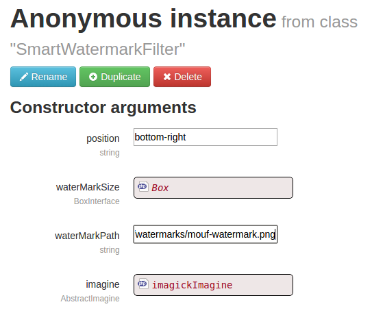

# Mouf Imagine Addons

This package comes along with the [utils.graphics.mouf-imagine](https://github.com/thecodingmachine/utils.graphics.mouf-imagine) one to provide additional Filters, let's say easier to use filters.

## Watermarking

The class `SmartWatermarkFilter` allows you to easily merge your image with a watermark, specifying :
  * position of the watermak (can be top, bottom, left, right, any combination of those, or center)
  * the size of the watermark
  * the path for the watermark file you want to apply

As a result, with an instance like that :

... injected in an `ImagePresetController` of the *utils.graphics.mouf-imagine* package, here is what you will get :

## Coming soon

Lots of nice filters (and you are free to make proposals :))
